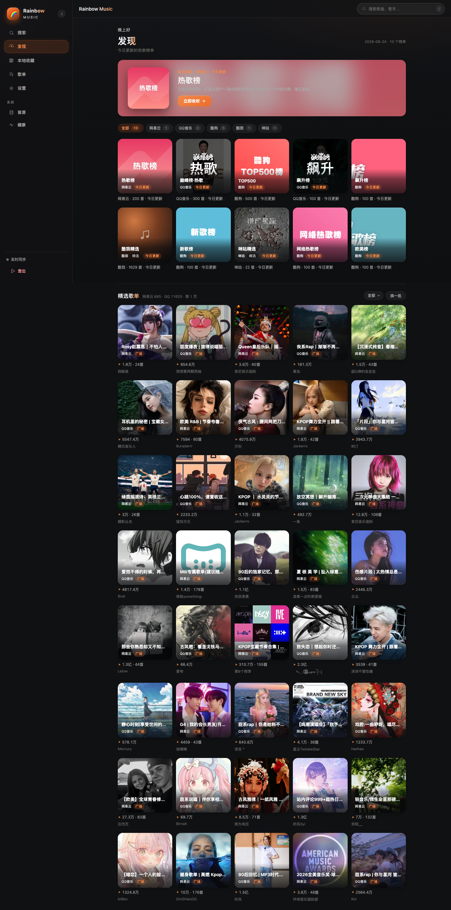
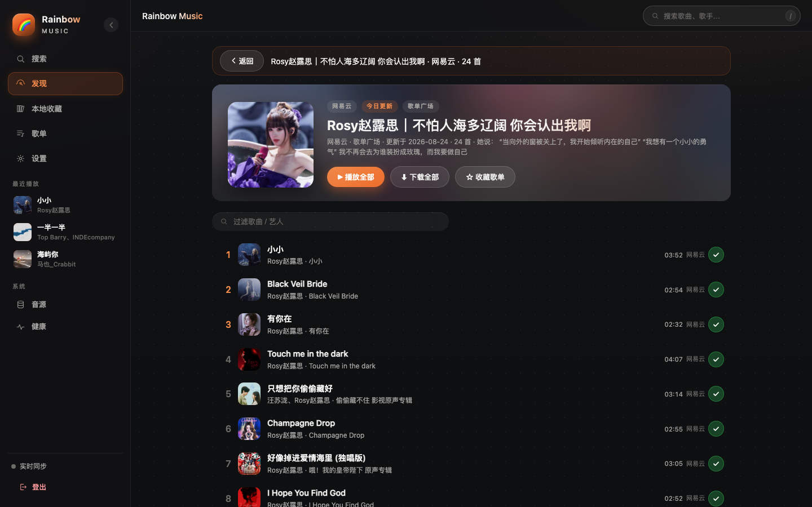
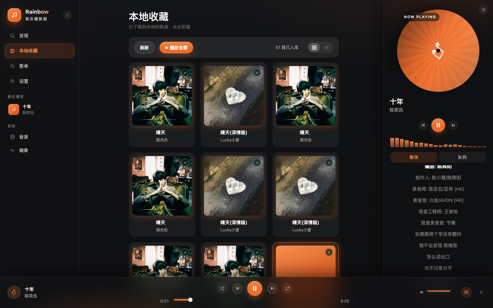

# Rainbow — 飞牛 NAS 音乐搜索 / 下载 / 元数据管理

> Rainbow Music（彩虹音乐）是面向 **飞牛 NAS（FnOS）** 的无头音乐下载工具：搜索、下载（含歌词 + 封面嵌入）、歌单管理、跨平台换源兜底、健康冒烟监控，全部通过一个轻量 Web 后台操作。
> 基于开源项目 [ro](https://github.com/leizi914599611-boop/ro)（Apache-2.0）二次开发，最终以 **.fpk 安装包** 形态交付。

---

## 目录

- [特性](#特性)
- [界面预览](#界面预览)
- [安装](#安装)
  - [方式一：.fpk 安装包（推荐）](#方式一fpk-安装包推荐)
  - [方式二：Docker 手动部署（ARM 用户兜底）](#方式二docker-手动部署arm-用户兜底)
- [首次使用（三步上手）](#首次使用三步上手)
- [免责声明与合规](#免责声明与合规)
- [排错 / 常见问题](#排错--常见问题)
- [开发者](#开发者)
- [NOTICE：上游致谢、许可证与修改说明](#notice上游致谢许可证与修改说明)

---

## 特性

- **5 平台**：kw(酷我) / kg(酷狗) / tx(QQ音乐) / wy(网易云) / mg(咪咕)
- **热门歌单**：发现页聚合 5 平台 7 榜（热歌/飙升/TOP500 + 酷我/咪咕精选），24h 本地缓存 + 服务端 5min 缓存，点卡进详情可过滤、整榜下载
- **四维度搜索**：歌曲名 / 歌手 / 专辑 / 歌单；支持单平台与聚合(全平台)搜索
- **下载全链路**：流式下载 + 元数据/歌词/封面嵌入（FLAC / MP3），SQLite 记录任务
- **跨平台换源兜底**：主平台音质降级链全失败 → 自动跨平台匹配同款 → 逐候选平台重试
- **歌单**：本地歌单管理 + 整单批量下载（≤200 首/批）
- **音源管理**：lx-music 格式音源脚本，本地上传 / URL 导入 / 热重载
- **实时进度**：SSE 推送任务状态
- **健康冒烟测试**：定时跑真实下载链路，平台×音源矩阵 + Bark/Server酱 告警
- **飞牛原生形态**：`.fpk` 一键安装进 FnOS 应用中心，下载目录可直接指向飞牛共享文件夹
- **轻量鉴权**：Web 登录 + API Key 双通道；低内存（SQLite + p-queue，实测 RSS ≈ 198MB）

---

## 界面预览

深色毛玻璃风格后台（🌈 Rainbow Music 彩虹音乐）：发现页聚合七榜热门歌单，搜索跨平台聚合，本地收藏点击即播，底部播放栏支持拖动进度与切歌。







---

## 安装

### 方式一：.fpk 安装包（推荐）

从 [Releases](../../releases) 页面下载最新的 `rainbow-<版本>.fpk`，两种安装途径：

**A. 应用中心图形化安装**

1. 打开 FnOS **应用中心** → 右上角 **本地安装 / 导入**；
2. 选择下载好的 `.fpk` 文件，按向导完成安装；
3. 安装完成后在应用列表启动 Rainbow，浏览器访问 `http://<NAS_IP>:23330/`。

**B. 命令行安装（SSH 登录 NAS 后）**

```bash
appcenter-cli install-fpk rainbow-0.2.0-r1.fpk
```

> `.fpk` 内部以 Docker 容器运行 Rainbow，镜像 tag 与包版本严格绑定（如 `v0.2.0-r1`），不使用 `latest`，升级行为完全可预期。

### 方式二：Docker 手动部署（ARM 用户兜底）

若 `.fpk` 在你的环境暂不可用（如部分 ARM 机型应用中心限制），可直接用 Docker Compose 部署同一镜像：

```yaml
# compose.yaml
services:
  rainbow:
    image: ghcr.io/<OWNER>/rainbow-music:v0.2.0-r1   # ⚠️ 与要安装的版本一致，禁止 latest
    container_name: rainbow
    restart: unless-stopped
    ports:
      - "23330:23330"
    environment:
      TZ: Asia/Shanghai
      RO_SERVER_HOST: 0.0.0.0
      RO_SERVER_PORT: "23330"
    volumes:
      - ./config.yaml:/app/config.yaml          # 配置（首次启动无此文件会自动生成）
      - ./data/downloads:/app/data/downloads    # 下载目录，可改为飞牛共享文件夹路径
      - ./data/sources:/app/data/sources        # 音源脚本目录
      - ./data/db:/app/data/db                  # SQLite（任务/歌单，持久化）
    mem_limit: 512m
```

```bash
mkdir -p data/downloads data/sources data/db
docker compose up -d
docker logs -f rainbow          # 首次启动会打印随机生成的登录密码（仅此一次）
```

多架构镜像（`linux/amd64` + `linux/arm64`）会自动匹配当前 CPU 架构。

---

## 首次使用（三步上手）

1. **设置登录密码**
   - `.fpk` 安装：首次打开 Web 界面进入**安装向导**，按提示设置管理员密码；
   - Docker 手动部署：若未提供 `config.yaml`，首启自动生成配置并**随机生成强密码**，在 `docker logs rainbow` 中打印一次，请立即保存（遗失可直接改 `config.yaml` 的 `auth.webLogin.password` 后重启）。
2. **导入音源**
   Rainbow **不内置、不随包分发任何音源**。你需要自行获取 lx-music 格式的音源脚本（`.js`），然后在「音源管理」页上传文件或粘贴 URL 导入（详见 [用户手册](./docs/USER-GUIDE.md#音源导入)）。**音源的获取与使用合规责任由用户自行承担。**
3. **搜索并下载**
   搜索页选择平台（或聚合搜索）→ 选音质（`flac24bit > flac > 320k > 128k`）→ 下载；任务页实时查看进度，完成后文件带歌词与封面标签。

完整功能说明见 **[docs/USER-GUIDE.md](./docs/USER-GUIDE.md)**；API 参考见 **[API.md](./API.md)**。

---

## 免责声明与合规

> ⚠️ **使用前请务必阅读。**

- Rainbow 是一个**工具**，本身不提供、不内置、不预装任何音乐内容或音源脚本；
- 音源脚本由用户**自行从第三方获取并导入**，本项目与音源的来源、内容、合法性无关；
- 本工具仅供**个人学习、研究与备份自己合法拥有的音乐**使用。将下载内容用于传播、售卖或侵犯任何第三方版权的行为均与本工具无关，由此产生的一切法律责任由使用者自行承担；
- 请勿将服务暴露到公网；局域网自用请遵守所在地区的法律法规与相关平台的服务条款。

---

## 排错 / 常见问题

**Q: 反向代理后 SSE 实时进度收不到事件？**
A: 反代必须关闭响应缓冲。Nginx 示例：

```nginx
location / {
  proxy_pass http://127.0.0.1:23330;
  proxy_http_version 1.1;
  proxy_set_header Connection '';
  proxy_buffering off;              # SSE 必需
  proxy_read_timeout 3600s;
}
```

**Q: 容器起不来 / 镜像拉取失败？**
A: 先 `docker logs rainbow`（或 FnOS 应用详情页的日志面板）看具体报错；拉取失败常见原因是网络不通或 tag 写错——镜像 tag 必须与 `.fpk` 版本一致（如 `v0.2.0-r1`），不存在 `latest` 标签。

**Q: 升级会不会丢数据？**
A: 不会。音乐文件、音源脚本、SQLite 任务/歌单记录全部在宿主机挂载卷（`data/downloads`、`data/sources`、`data/db`）与 `config.yaml` 中，镜像本身不含任何数据。升级 = 换新版 `.fpk`（或 compose 中改 image tag 后 `docker compose up -d`），数据原样保留。

**Q: 登录一直失败 / 提示未设置密码？**
A: `config.yaml` 的 `auth.webLogin.password` 为空。空密码禁止登录，设好密码后重启容器。

**Q: 搜到的歌下载失败？**
A: 单平台/音源可能临时不可用，Rainbow 会自动跨平台换源兜底；若全平台失败，到「音源管理」页检查音源状态是否 `ready`，或「健康看板」查看冒烟矩阵定位问题平台。

**Q: 音源导入了但不生效？**
A: 确认 `sources.hotReload: true`，或在音源页手动「热重载」；脚本语法错误会导致加载失败，看容器日志。

更多问题见 [用户手册 FAQ](./docs/USER-GUIDE.md#常见问题)。

---

## 开发者

开发环境要求 **Node.js ≥ 20**（推荐 22）+ Docker。

```bash
# 本地开发（热重载）
cd server
npm install
cp ../config.example.yaml ../config.yaml   # 在项目根准备配置，按需修改
npm run dev                                # tsx watch，默认 http://localhost:23330

# 类型检查 + 构建
npm run typecheck && npm run build

# Docker 构建 + 运行
docker compose build && docker compose up -d

# 打包 .fpk（产物：dist-fpk/rainbow-${FPK_VERSION}.fpk）
FPK_VERSION=0.2.0-r1 \
FPK_IMAGE=ghcr.io/<owner>/rainbow-music \
FPK_IMAGE_TAG=v0.2.0-r1 \
scripts/build-fpk.sh
```

架构、模块划分与性能加固配置项详见 **[docs/DEVELOPMENT.md](./docs/DEVELOPMENT.md)**；CI 发布流水线见 [`.github/workflows/build.yml`](./.github/workflows/build.yml)（tag `v*` 触发：typecheck → 多架构镜像推 GHCR → 组装 fpk → GitHub Release）。

---

## NOTICE：上游致谢、许可证与修改说明

本项目 **Rainbow** 是基于 [leizi914599611-boop/ro](https://github.com/leizi914599611-boop/ro)（**Apache-2.0** 许可证）的二次开发，面向飞牛 NAS 场景的音乐下载工具。在此诚挚感谢上游项目及其所有开源贡献者。

上游致谢、版权声明与相对上游的修改点详见仓库根目录的 **[NOTICE](./NOTICE)** 文件；许可证全文见 **[LICENSE](./LICENSE)**。

---

## License

Apache-2.0（继承自上游 [ro](https://github.com/leizi914599611-boop/ro)）
