# Rainbow Music 彩虹音乐 · 用户手册

面向飞牛 NAS（FnOS）用户的完整使用指南。安装方式见 [README](../README.md#安装)。

---

## 目录

- [安装向导与首次登录](#安装向导与首次登录)
- [FN ID 登录与多用户](#fn-id-登录与多用户)
- [音源导入](#音源导入)
- [下载目录：指向飞牛共享文件夹](#下载目录指向飞牛共享文件夹)
- [发现：热门歌单](#发现热门歌单)
- [搜索与下载](#搜索与下载)
- [NAS 本地音乐库](#nas-本地音乐库)
- [歌单](#歌单)
- [设置](#设置)
- [健康看板](#健康看板)
- [升级与数据保留](#升级与数据保留)
- [常见问题](#常见问题)

---

## 安装向导与首次登录

`.fpk` 安装完成并启动后，浏览器打开 `http://<NAS_IP>:23330/`：

1. **安装向导**：首次访问会进入初始化向导，按提示设置管理员登录密码；v0.2.1 起向导新增**「音乐库扫描目录（可选）」**字段——要导入本地音乐库的 NAS 目录（绝对路径，可填多个，逗号分隔），留空则只扫描默认下载目录（详见 [NAS 本地音乐库](#nas-本地音乐库)）。

   > 安装向导首屏（设置密码页）截图待正式发版时补充；登录页见下方截图。

2. 设置完成后自动跳转登录页，使用刚设置的密码登录。

   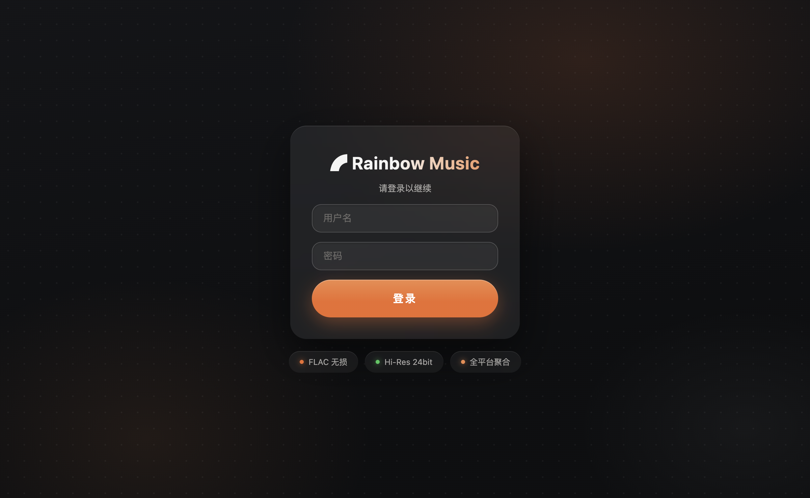

   *图注：登录页 —— 输入管理员密码进入主界面（fnOS 网关入口进入时无需密码，见下一章）。*

> **Docker 手动部署用户**：无安装向导。若未提供 `config.yaml`，首启自动生成配置并随机生成强密码，在 `docker logs rainbow` 中**仅打印一次**；遗失可直接编辑 `config.yaml` 的 `auth.webLogin.password` 后重启容器。手动部署无网关入口，永远使用端口 + admin 账密登录。

登录成功后进入主界面（左侧导航：🌈 Rainbow Music 品牌 + 搜索 / 发现 / 本地收藏 / 歌单 / 设置，系统区另有音源 / 健康；顶栏常驻全局搜索 pill，按 `/` 随时唤起；顶栏右侧为账号徽章）。**登录后默认落在「发现」页** —— 聚合五大平台十个榜单 + 精选歌单广场的歌单首页：


*图注：主界面 —— 登录后默认进入发现（热门歌单）页：横幅推荐位 + 平台分组 tab + 十榜网格，下方为「精选歌单」广场分区（卡片悬停浮现播放钮）。*

---

## FN ID 登录与多用户

v0.2.1 起 Rainbow 接入 fnOS 统一网关：从 fnOS 桌面/应用列表的 Rainbow 图标进入时**免密自动登录**，不再需要输入管理员密码。

**网关免密进入**：fnOS 已登录的用户点击 Rainbow 图标，登录页会显示「已通过 FN ID 登录为 <你的用户名>」的身份卡，点「进入 Rainbow」直达主界面——账号密码由 fnOS 统一校验（含 FN ID 远程访问），Rainbow 只接收可信身份，家庭内网与外网远程访问体验一致。

   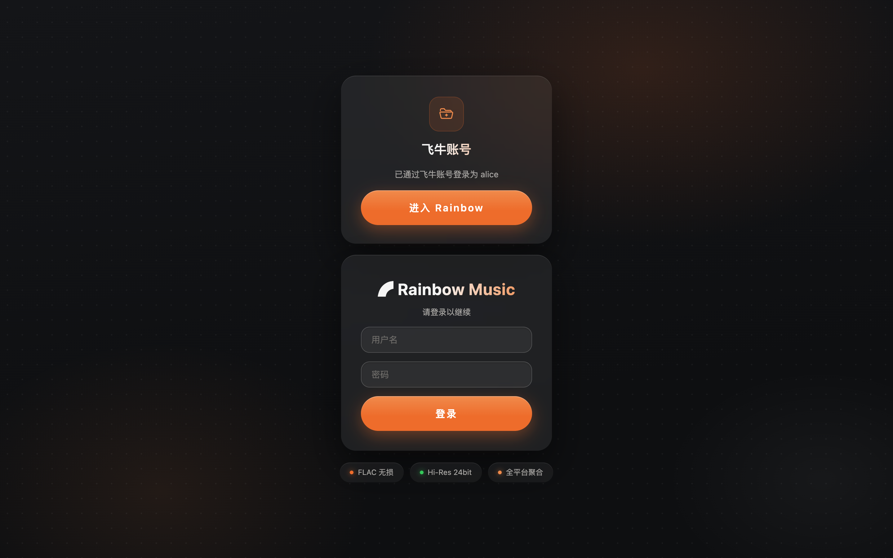

   *图注：网关模式登录页 —— 账密表单替换为 FN ID 身份直达卡（本地 mock 环境截图）。*

**双入口并存**：`http://<NAS_IP>:23330/` 端口直连入口完全保留，仍用 admin 账密登录（浏览器老书签、脚本与自动化不受影响）。两个入口进入的是同一个服务，数据互通。

**顶栏账号徽章**：登录后顶栏右侧显示当前用户（首字头像 + 用户名）；点开可查看 uid 与管理员标识，并可「登出」。点登出后回到登录页重新认证。

**多账号数据隔离**：每位经网关进入的 fnOS 用户拥有独立空间——歌单、播放历史、收藏、NAS 曲库勾选与扫描结果、界面偏好（视图/排序/密度等记忆）全部按用户隔离，互相不可见。端口直连的 admin 是独立身份（uid=`legacy`），同样不与网关用户互通。

**权限边界**：fnOS 普通成员可正常搜索、下载、播放、管理自己的歌单与 NAS 曲库；影响全局的操作（修改设置、生成/撤销 API Key、音源启停与删除、批量刮削、手动触发冒烟测试、测试推送）仅管理员可用——普通成员操作时返回「需要管理员权限」提示。

> **存量数据归属**：v0.2.0 及以前创建的歌单等数据升级后自动归属安装管理员（admin 账密登录后全部可见，一条不少）；其他 fnOS 用户看不到这些旧数据。版本要求与部署细节见 [FNOS-DEPLOY](FNOS-DEPLOY.md)。

---

## 音源导入

Rainbow **不内置、不随包分发任何音源**。音源为 lx-music 格式的 JavaScript 脚本（`.js`），需用户**自行从第三方渠道获取**，并自行承担获取与使用的合规责任（见 README 免责声明）。

导入方式（音源管理页）：

1. **本地文件上传**：点击「上传音源」选择 `.js` 文件（≤5MB）；
2. **在线 URL 导入**：粘贴音源脚本的直链 URL，系统自动拉取保存；
3. **直接放文件**：把 `.js` 拷进容器的音源目录（`data/sources/`，fpk 场景对应应用数据目录下的 sources 文件夹），开启热重载会自动加载。

   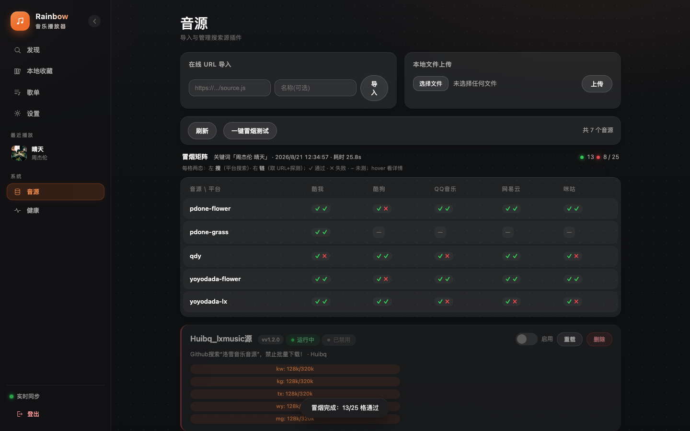

   *图注：音源管理页 —— 展示已导入音源的支持平台、音质与启停开关。*

导入后每个音源展示：名称、支持的平台（kw/kg/tx/wy/mg）、可用音质、状态（运行中 / 不可用 / 加载中）。可随时启停、热重载或删除。已禁用或加载失败的音源卡片会置灰并带左侧红条（P1b 失效标注），一眼识别不可用。

**一键冒烟**：音源页的「一键冒烟测试」按钮可对全部**启用中的就绪音源**跑一轮即时验证（固定关键词，同步返回，整体 ≤60s）：

- 输出「音源 × 平台」结果矩阵，每格两态 —— 左「搜」（平台搜索）/ 右「链」（取 URL + 探测），✓ 通过 / ✗ 失败 / — 未测，悬停格子看耗时与错误详情；
- 全部可测平台均失败的音源会标注「建议禁用」，与卡片置灰判定同源；
- 与健康页的定时全量冒烟互斥（任一在跑则提示稍后），结果不落库、不触发告警，适合导入新音源后快速验证。

   

   *图注：音源管理页 —— 音源卡片与启停开关；「一键冒烟测试」输出的音源×平台矩阵（每格搜/链双态，绿✓红✗灰—）。*

**失效提示**：聚合搜索中某平台请求完全失败时，结果区顶部会出现暗红色警示条（含平台名与错误摘要），避免对同一不可用音源重复尝试；仅个别平台失败不影响其余结果浏览。

**排查要点**：脚本语法错误或格式不是 lx-music 音源格式会加载失败，查看容器日志定位；音源失效（上游脚本更新）时重新导入新版本即可。各音源的可信度可参考 [docs/SOURCES.md](SOURCES.md) 的实测矩阵（含逐平台可用性与入库决策）。

---

## 下载目录：指向飞牛共享文件夹

默认下载目录为应用数据目录下的 `downloads/`。

**设置页在线查看与修改**：设置页「下载设置」卡片首行即「下载目录」—— 等宽字体只读展示当前**解析后的绝对路径**（悬停可见完整路径），点行内「修改」按钮即可在线更改，无需登录 SSH。路径语义：**相对路径**相对程序根目录解析（如 `data/downloads`），**绝对路径**原样使用（如 `/vol1/1000/music`）；保存即时落盘，但**需重启服务后完整生效** —— 未重启期间行内显示橙色「待重启」角标，重启后自动消失。悬停曲库任一歌曲行（网格卡片 / 列表行）可见「文件：完整路径」，可随时确认文件实际落盘位置。

推荐将其指向飞牛的**共享文件夹**，便于媒体库应用（如飞牛影视/音乐）直接扫描：

1. 在 FnOS **文件管理** 中创建共享文件夹（如 `music`）；
2. SSH 登录 NAS，找到共享文件夹的绝对路径（通常为 `/vol1/1000/music`，`1000` 为你创建时选择的属主用户 ID）；
3. 编辑 `config.yaml`：

   ```yaml
   download:
     dir: /vol1/1000/music    # 绝对路径，直接生效（fnOS 场景无需相对路径）
   ```

4. 重启应用（应用中心 → Rainbow → 重启，或 `docker compose restart`）。

> `.fpk` 安装时也可在向导/应用设置中配置卷挂载，把共享文件夹映射进容器后再填写容器内路径。

以上手动编辑 `config.yaml` 与在设置页「下载目录」行在线修改**效果等价**（后者同样要求重启后完整生效）；部署期一次性设定推荐手动编辑，日常调整用设置页更方便。

文件命名模板可在设置页调整（`{name} - {singer}` 等占位符）。

---

## 发现：热门歌单

「发现」页是登录后的默认首页（🌈 Rainbow Music 彩虹音乐），聚合 **5 平台 10 榜**：网易云热歌榜，QQ 音乐巅峰榜·热歌 / 飙升榜，酷狗 TOP500 / 飙升榜 / 新歌榜 / 网络热歌榜 / 欧美榜（5 榜），以及酷我精选、咪咕精选（后两榜为关键词精选榜）。卡片右上角「今日更新」橙色徽标标示当日已更新的榜单。页面自上而下：

- **横幅推荐位**：固定展示「热歌榜 · 网易云」（数据缺失时自动回退首榜），大封面 + 毛玻璃铺底 + 「立即收听」按钮，点击直接进入该榜详情；
- **平台分组 tab**：「全部 / 网易云 / QQ音乐 / 酷狗 / 酷我 / 咪咕」单选过滤，每个 tab 带实时榜单计数（如 全部 10 / 酷狗 5），切换在内存中即时完成、不重新拉取数据；所选平台记忆在本机，下次打开自动恢复；
- **榜单网格**：十榜卡片依次错峰入场（stagger 淡入上移），悬停浮现播放钮；进入榜单详情再返回时，自动恢复离开前的滚动位置；
- **精选歌单分区**：榜单网格之下的独立分区「精选歌单」，展示**网易云 / QQ 音乐**两平台广场的精选歌单（每页 40 张交错混排，网易云分类 / QQ 推荐位）——卡片带平台徽标与播放数（万 / 亿格式化），点击进入歌单详情，操作与榜单详情完全一致（过滤 / 收藏歌单 / 下载全部）。分区右上：**「分类」下拉**（全部 / 华语 / 流行 / 摇滚 / 电子，作用于网易云源）切换后重拉第一页；**「换一批」**翻页拉取新一批，到底自动回第 1 页循环。该分区不受上方平台 tab 影响（广场为 UGC 歌单，与平台榜单不同类）；数据本地缓存 24 小时、服务端缓存 5 分钟。个别 QQ 音乐推荐位歌单受平台限制可能无法打开详情，页面会提示并可重试。


*图注：发现页 —— 横幅推荐位 + 平台分组 tab（含计数）+ 十榜网格（今日更新徽标 + 平台/曲目数副标），下方「精选歌单」分区（40 张广场歌单卡：平台徽标 / 播放数 / 分类与换一批控件）；某音源失败时在对应位置显示橙色警告占位卡，不影响其余平台。*

**加载体验**：首次进入（无缓存）时先展示横幅 / tab / 卡片的 shimmer 骨架屏，数据到达后无缝淡入；缓存命中则直接渲染不闪屏。

**缓存策略**：榜单数据本地缓存 24 小时（浏览器 localStorage），期间再次进入直接渲染缓存、不发新请求；服务端另有 5 分钟短缓存，避免重复拉取上游。某平台失败时前端会缩短重试间隔（约 5 分钟后自动重试该平台）。

**封面说明**：十榜中 9 榜展示榜单官方封面，个别榜单缺官方封面时自动回退榜首歌曲封面；「酷我精选」按关键词搜索拼装，上游搜索接口无封面字段，卡片显示橙色渐变占位 —— 属预期设计，不是故障。

**歌单详情**：点击任一榜单卡或广场歌单卡进入详情页（两者共用同一模板，广场歌单徽标为「歌单广场」）—— 大封面模糊铺底横幅（榜单名、平台、更新时间、曲目数）+ 排名列表（前三名高亮）。列表支持：

- **过滤**：顶部输入框按歌名 / 艺人实时过滤，右侧显示「命中数 / 总数」；
- **分块加载**：首屏展示前 30 首，滚动到底点「加载更多」；
- **收藏歌单**：横幅右侧「☆ 收藏歌单」一键将当前榜单 / 广场歌单保存为本地个人歌单（单请求事务建单，保存后到「歌单」页可见；同名歌单自动加序号），完成后按钮变为「✓ 已收藏」；
- **返回**：左上角「← 返回」回到榜单网格。


*图注：歌单详情（广场歌单示例，徽标「歌单广场」）—— 大封面横幅 + 曲目列表 + 过滤输入框，支持播放全部 / 下载全部 / 收藏歌单；行尾状态钮三态实时联动（本例 24 首均已入库，全部显示绿色对勾「已下载 · 点击播放」，悬停变播放三角）。*

**下载语义（行内三态）**：榜单 / 广场歌单歌曲是上游聚合数据，本地并无音频文件，需下载后才能播放。每行右侧状态钮呈**三态**并随下载任务（SSE 实时推送）局部联动，无需刷新页面：

- **未下载**（空心下载圈钮）：点击钮提交单曲下载后立即变下载中环；点击行本身提示「未下载歌曲点击行内 ⬇ 下载；已下载歌曲点击即播」；
- **下载中**（脉冲进度环）：环随任务进度实时推进（0→100%），点击行提示「下载中…完成后点击行即可播放」；
- **已下载**（绿色对勾，悬停变播放三角 ▸）：点击行或绿勾钮**直接播放** —— 自动以当前列表（含过滤视图）内全部已下载曲目组成队列（榜位序）从该首播起，当前播放行高亮序号变均衡器动画；

「▶ 播放全部」**优先播放已入库曲目**：已下载的立即入队播放，混合状态下 toast 提示「已播 N 首（M 首未下载可点行内 ⬇ 下载）」，全部未下载时才引导整榜加入下载队列；「⬇ 下载全部」直接批量入队（默认 FLAC 音质，分批并发提交），已在本地收藏的曲目自动跳过去重（toast 显示入队 / 跳过计数）。下载完成后无需离开本页——行自动变绿勾即可点击播放。

---

## 搜索与下载

**顶栏全局搜索 pill**：任意页面顶栏常驻搜索框，轻量入口语义（联想与历史集中在搜索页主框，pill 本身不弹联想）——

- 输入关键词后**回车**：跳转搜索页并自动执行完整搜索（关键词同步带入主搜索框）；
- **点击 / Tab 聚焦**（不在搜索页时）：跳转搜索页并聚焦主搜索框，带出完整联想与历史体验；
- **`/` 快捷键**：任意非输入位置按 `/` 直接聚焦 pill（留在当前页继续打字）；焦点已在任意输入框内时按 `/` 照常输入字符，不触发快捷键。

**搜索页**：

- 输入关键词，选择单个平台或「聚合」模式（同时搜多个平台）；
- 支持按歌曲 / 歌手 / 专辑 / 歌单四个维度搜索；
- 结果列表可单曲下载，也可加入歌单；
- **实时联想**：输入停顿约 300ms 即自动弹出「实时联想」组（网易云 / QQ 音乐各取前 5 条、同名跨平台去重），↑↓ 键选择、Enter 直接搜索选中词；联想与搜索历史共用同一浮层（联想组在上、历史组在下，组标题区分），网络异常时静默降级不打断输入；
- **搜索历史**：搜索成功的关键词自动记录（本机保存最近 10 条，去重置顶），再次聚焦搜索框即弹出历史浮层，支持 ↑↓ 选择、Enter 回搜、Esc 关闭、单条删除与一键清空。

   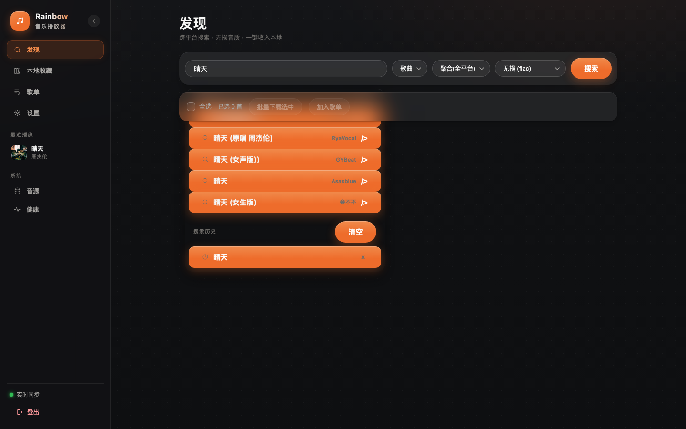

   *图注：搜索 —— 输入中即弹出「实时联想」浮层（联想组在上、历史组在下），回车或点击联想词直接发起完整搜索。*

   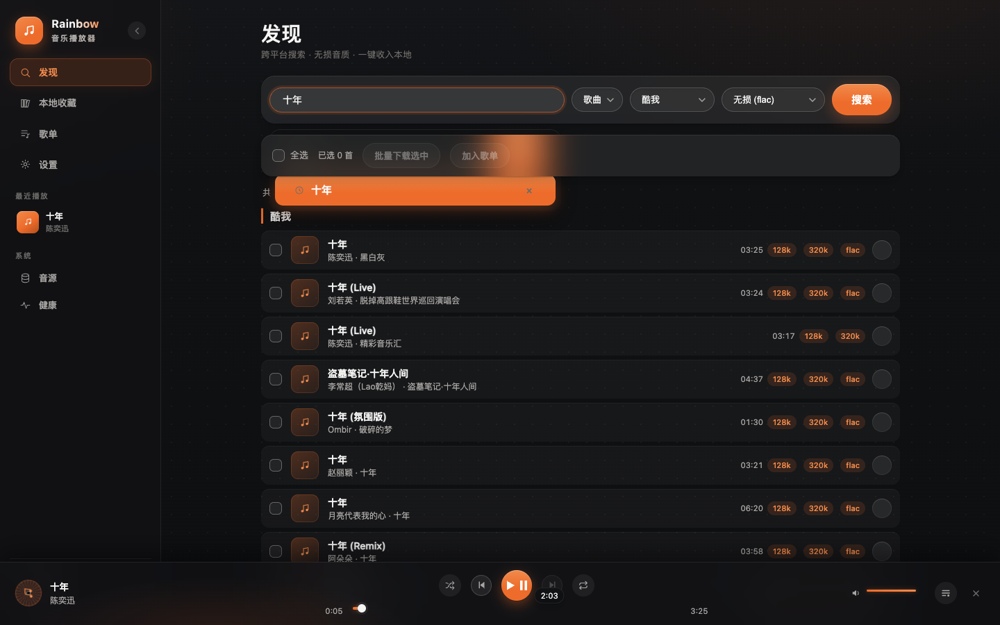

   *图注：搜索历史 —— 聚焦搜索框弹出历史浮层，点击历史词立即回搜。*

**音质**：`flac24bit > flac > 320k > 128k`。默认音质在设置页配置；目标音质不可用时按降级链自动尝试。

**本地收藏（下载任务）**：

- 「本地收藏」页汇聚所有已下载/进行中的任务，实时展示下载进度（SSE 推送），状态：排队中 / 下载中 / 已完成 / 已完成(换源) / 失败 / 已取消；
- 悬停任一歌曲行（网格卡片 / 列表行）可见「文件：完整路径」，确认音频文件实际落盘位置（配合设置页「下载目录」行，路径去向一目了然）；
- 失败任务可单独重试或取消；
- `completed_with_warnings` 表示主平台失败后经**跨平台换源**命中同款，属正常兜底：曲目信息用原曲，歌词/封面用实际命中平台。

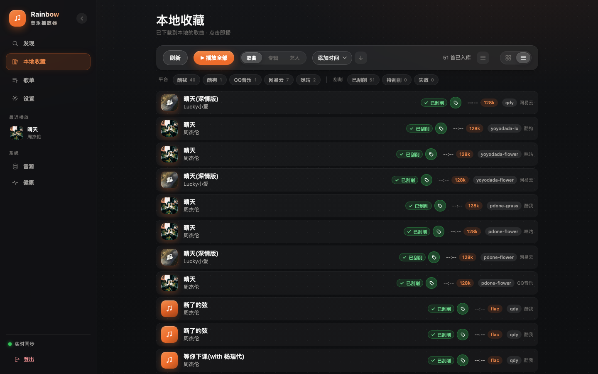

*图注：本地收藏 · 网格视图（默认）—— AM 风格大封面卡片，悬停浮现播放按钮与光效，右上角绿标为已刮削。*

**双视图切换**（P1a）：曲库右上角的分段控件可在**网格 / 列表**两种视图间切换：

- **网格**（默认）：Apple Music 风格大封面卡片，悬停浮现播放按钮；当前播放卡片带橙色高亮；
- **列表**：56px 行高的紧凑契约列表（封面、歌名/歌手、刮削徽标、音源、音质、时长），信息密度更高；
- 选择会记忆在本机（下次打开自动恢复），≤900px 窄屏下自动回退为单列网格，分段控件隐藏。

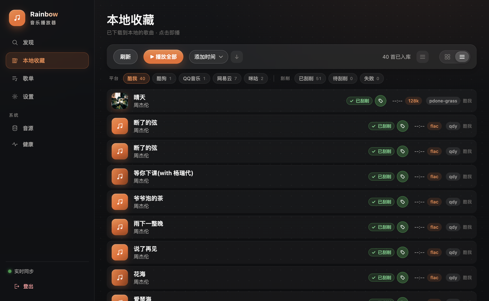

*图注：本地收藏 · 列表视图 —— 紧凑行列表，行内展示刮削徽标与实际命中音源，当前播放行橙色高亮。*

**维度切换**：曲库工具栏的「歌曲 / 专辑 / 艺人 / NAS」四段钮可切换浏览维度：

- **歌曲**（默认）：逐曲列表 / 网格；
- **专辑**：按专辑聚合的大封面卡（副标显示首位艺人与曲目数），点击卡片进入该专辑的过滤视图；
- **艺人**：按艺人聚合的头像卡（副标显示曲目数与专辑数），点击卡片进入该艺人的过滤视图；
- **NAS**：扫描 NAS 目录里的已有音乐文件入库播放（独立面板，见 [NAS 本地音乐库](#nas-本地音乐库)）；
- 过滤视图顶部显示橙色面包屑（「专辑：xxx · N 首」），点「← 返回」回到聚合网格；过滤视图内的排序、筛选、播放、刮削等交互全部可用，筛选 chips 计数也随当前上下文联动重算；
- 维度选择记忆在本机（按用户隔离）；未刮削（缺专辑/艺人字段）的曲目归入「未知专辑 / 未知艺人」弱化组，恒排末尾。

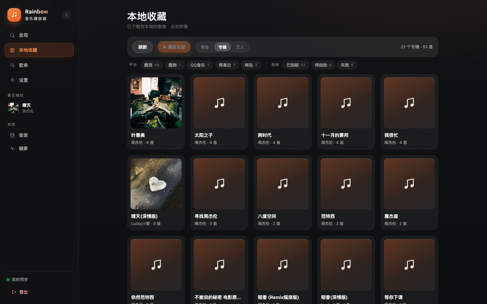

*图注：本地收藏 · 专辑维度 —— 按专辑聚合的大封面卡网格，点击卡片进入该专辑过滤视图（面包屑返回）。*

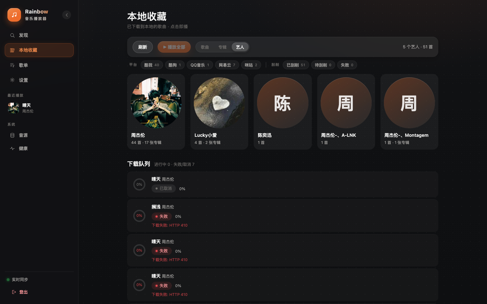

*图注：本地收藏 · 艺人维度 —— 按艺人聚合的头像卡，点击进入该艺人过滤视图。*

**排序与筛选**：曲库工具栏提供会话级的排序与筛选（刷新页面后恢复默认，不写入配置）：

- **排序**：按添加时间（默认，最新在前）/ 标题 / 艺术家 / 时长排序，方向钮一键切升降序；网格与列表视图均生效，排序结果同时作用于「播放全部」与行点击播放的队列顺序（所见即所得）；
- **筛选**：平台（酷我/酷狗/QQ/网易/咪咕等，含实际入库的非标准平台）与刮削状态（已刮削/待刮削/失败）两组 chips，组内单选、组间叠加（AND），再点已选中 chip 取消；数字为当前条件下的曲目计数，随维度与过滤视图联动重算。

**列表密度**：列表视图下可点击密度按钮在三档行高间循环切换 —— **舒适 56px（默认）/ 紧凑 44px / 宽松 68px**，选择记忆在本机；网格视图与窄屏下按钮自动隐藏。

已入库的曲目可直接点击播放，播放状态在底部播放栏实时展示：


*图注：本地收藏 · 播放中 —— 曲目播放进度、音质与封面展示。*

宽屏（≥1280px）下，点击播放栏右侧的面板按钮可展开 **Now Playing 沉浸面板**；配合 shuffle 随机播放与 repeat 列表/单曲循环模式（repeat 钮上的「1」角标即单曲循环）。面板内含「歌词 / 队列」两个标签页：

- **歌词**（默认）：自动拉取歌词并随播放逐行高亮居中滚动，拖动进度条会立即跳到对应行；若歌词无时间轴（或时间轴损坏），自动降级为纯文本展示，顶部会标注「纯文本歌词 · 无时间轴」。歌词区支持**鼠标按住拖拽**跟手滚动（滚轮/触摸同样生效），拖动后自动跟随暂停 3 秒，松手 3 秒内不抢滚，右侧为 Hume 风格橙色细滚动条；
- **队列**：播放队列快捷切歌；
- 播放时封面以**黑胶唱片**方式匀速旋转，暂停即停转；标题下方还有一条 20 柱实时**频谱**（Web Audio 分析，暂停归零；系统开启「减弱动态效果」时降级为静态三柱）。

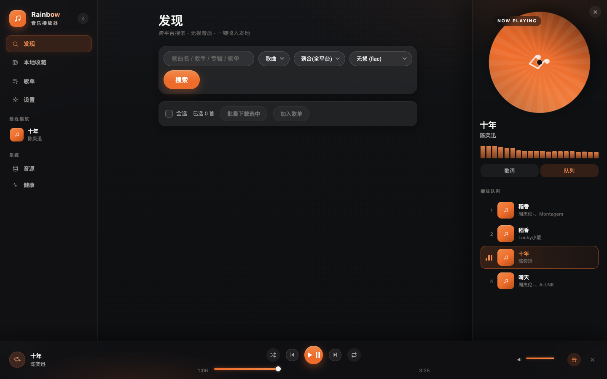

*图注：Now Playing 沉浸面板 —— 播放队列与大封面展示，播放栏含随机/循环播放模式（「1」角标为单曲循环）。*

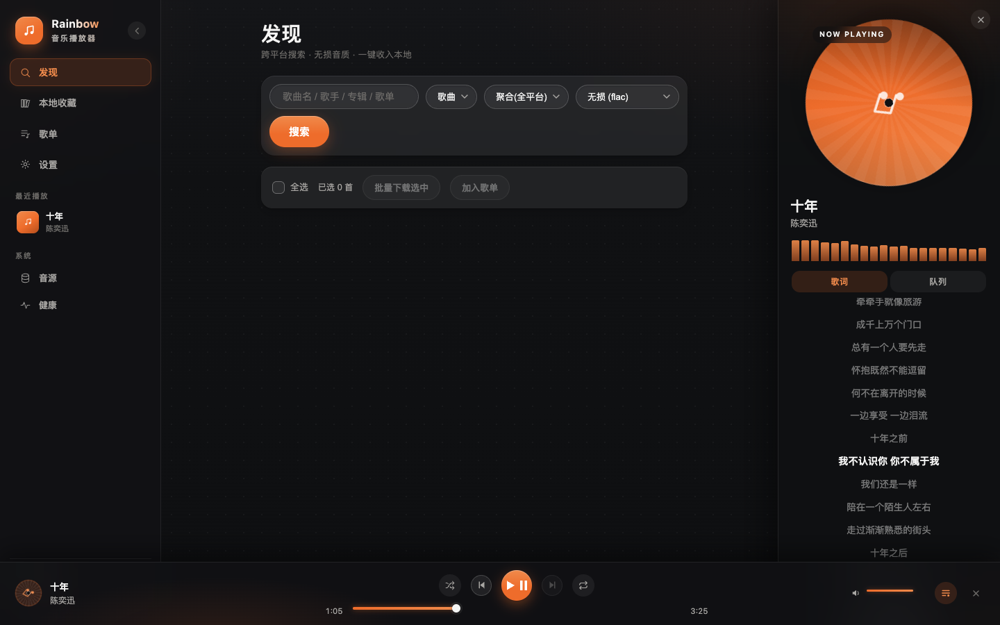

*图注：滚动歌词 —— 当前行高亮居中跟随播放，黑胶封面与 20 柱频谱同步展示。*

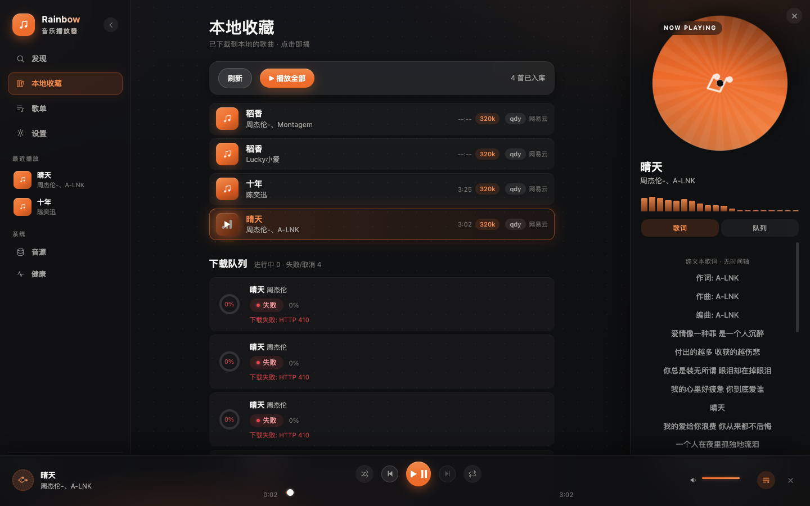

*图注：纯文本歌词降级 —— 无有效时间轴时静态展示，顶部标注「纯文本歌词 · 无时间轴」。*

宽屏下还可以用侧栏顶部的折叠按钮把侧边栏收成 **64px 窄图标栏**，给列表留出更多空间：

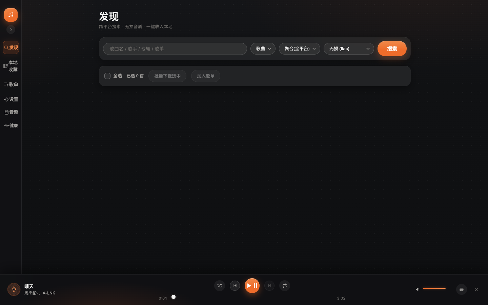

*图注：侧栏折叠 —— 窄图标模式，主内容区更宽。*

---

## NAS 本地音乐库

v0.2.1 新增：把 NAS 上**已有的音乐文件夹**（历史收藏、其他工具下载的歌、手动拷入的专辑）直接扫描入库播放，无需把文件搬进下载目录。入口在「本地收藏」页的维度切换第四档 **「NAS」**。

**扫描配置**：首次进入显示「扫描根配置」卡——列出可用的目录（安装向导配置的「音乐库扫描目录」+ 默认下载目录），勾选要纳入的目录后「保存」，再点「开始扫描」。扫描根按用户隔离（每人可勾选不同目录）。没有可选目录时说明向导未配置扫描目录，可升级时在向导重新填写或参考 [FNOS-DEPLOY 排查指南](FNOS-DEPLOY.md#扫描根不可见排查)。

**扫描过程**：实时进度条（「正在遍历目录…」→「正在读取元数据…」，含当前目录/计数），完成后列表自动刷新。支持格式：mp3 / flac / m4a / ogg / opus / wav / aac；重复扫描走增量（文件大小与修改时间未变则跳过），万首级大库也不必担心重复扫描慢。

   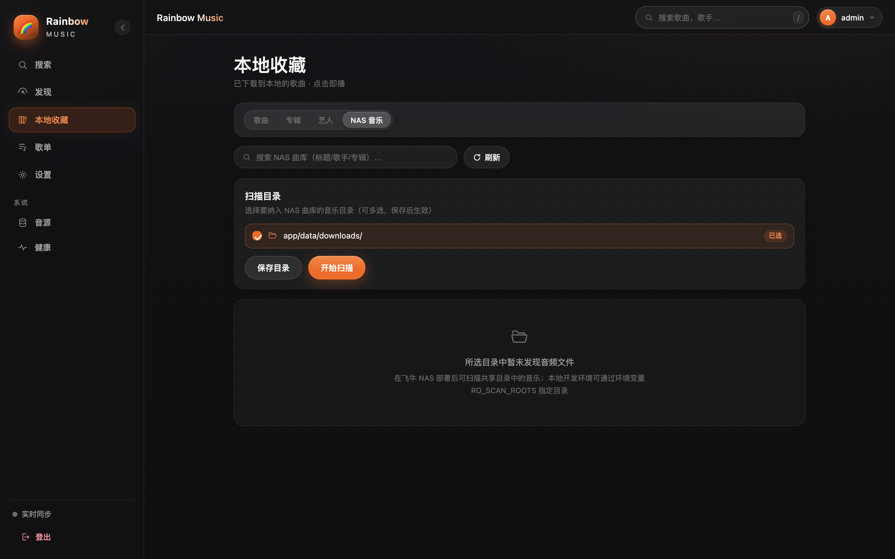

   *图注：NAS 音乐 tab —— 扫描根配置卡（目录多选）+ 扫描进度 + 曲目列表（分页/搜索），行点击直接播放。*

**播放与浏览**：曲目列表按入库时间倒序分页（100 首/页，「加载更多」续拉），顶部搜索框按歌名/歌手过滤；**点击行即播放**（流式传输，进度条可随意拖动），封面自动从文件标签读取（flac 内嵌图 / mp3 APIC），播放历史自动记录（每账号最近 200 条）。当前播放行橙色高亮，与底部播放栏/Now Playing 面板联动。

**与下载曲目的关系**：

- 「本地收藏」的歌曲/专辑/艺人三档展示的是**下载任务产物**；「NAS」档展示的是**已有文件的索引**——同一首歌下载过又同时在扫描目录里时，两处各自出现（文件路径不同）；
- 删除 NAS 曲目（如列表提供删除入口）只删索引不删文件，下次扫描若文件仍在会重新出现；
- 下载目录默认也是扫描根之一，因此「下载全部」入库的歌在 NAS 档也能直接看到。

---

## 歌单

- 「歌单」页创建本地歌单，从搜索结果添加歌曲；也可在「发现」页榜单 / 广场歌单详情点「☆ 收藏歌单」**一键整单收藏**（自动带入全部曲目与封面拼贴，同名自动加序号）；
- 支持**整单批量下载**（单批 ≤200 首），音质可单独指定；
- 歌单存于本地 SQLite，容器重建不丢失（前提是数据目录已挂载）。

   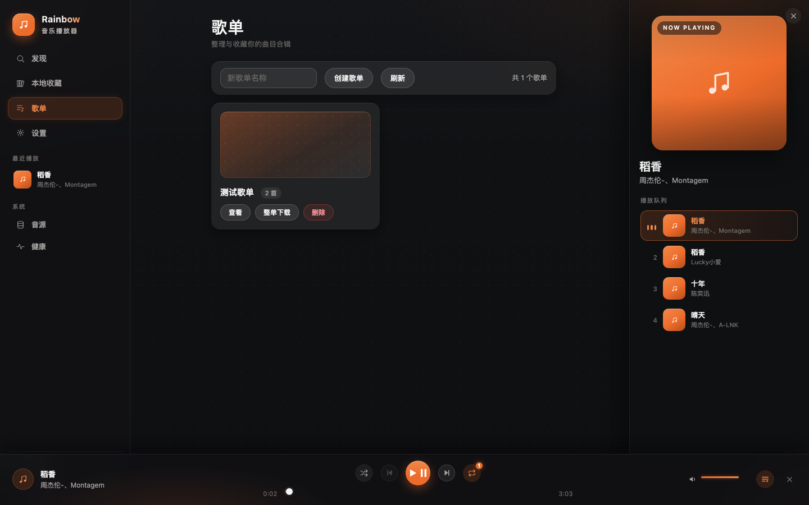

   *图注：歌单 —— 歌单卡片与整单批量下载。*

点「查看」进入歌单详情：曲目以表格化行卡展示（序号、封面、歌名/歌手、平台、单曲下载/移除）：

- **拖拽排序**：悬停行首「≡」手柄按住拖动即可重排（目标行显示插入指示线），松手即保存顺序；保存失败自动回滚并提示；手柄仅在悬停时可见，触屏窄屏（≤900px）暂不支持；
- 单曲下载 / 移除不受拖拽影响（仅手柄可发起拖动）；
- **行状态三态与直接播放**：与发现页歌单详情同构 —— 行尾状态钮呈三态（未下载 ⬇ / 下载中进度环 / 已下载绿勾）并随下载任务 SSE 实时联动；已下载曲目点击行（或绿勾钮）即播放，队列取歌单内全部已下载曲目（DOM 行序，拖拽排序后即时生效），当前播放行橙色高亮，与「本地收藏」页高亮互不冲突。

   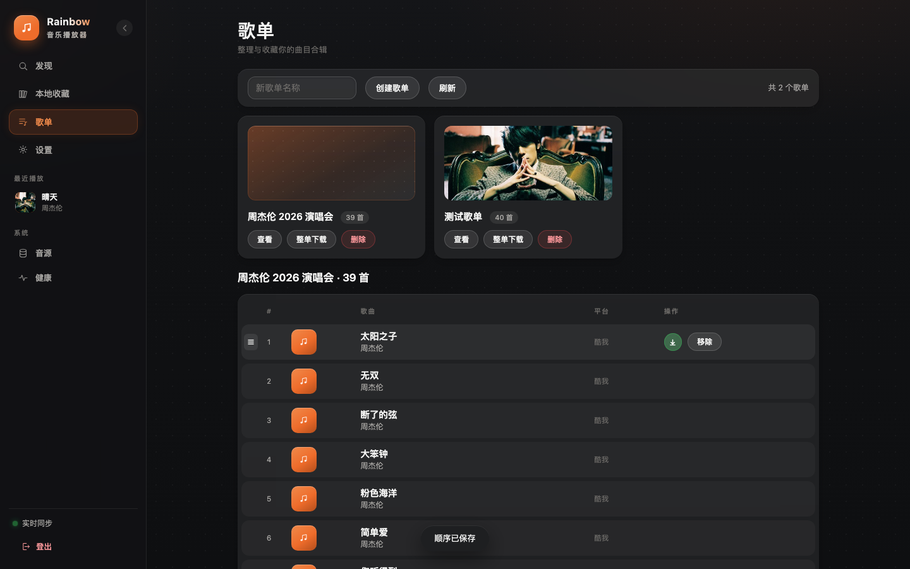

   *图注：歌单详情 —— 表格化曲目列表，行首「≡」为拖拽排序手柄（悬停显示），支持单曲下载与移除。*

---

## 设置

设置页可调整（修改即时落盘，部分项立即生效）：

| 分组 | 项目 |
|---|---|
| 下载 | 下载目录、并发数、默认音质、命名模板、封面/歌词嵌入开关、封面尺寸 |
| 元数据刮削 | 启用开关、下载完成后自动刮削、批量刮削（全部待处理 / 强制重刮全部） |
| 冒烟测试 | 开关、cron 周期、测试关键词、是否校验歌词/封面、告警阈值 |
| 告警 | Bark / Server酱 的启用与参数（可发测试推送） |
| API Key | 生成 / 重新生成 / 撤销（**明文仅生成时显示一次**，请立即保存） |

> 密钥类字段（密码 / API Key / 告警密钥）在页面上只显示「已设置 / 未设置」，绝不回显明文。

### 下载目录

「下载设置」卡片首行即**下载目录**，等宽只读展示当前解析后的**绝对路径**（悬停 title 显示完整路径，页面截断时不丢信息）：

- **查看**：展示的是服务端解析后的最终路径 —— 相对路径配置（如 `data/downloads`）也会展开为绝对路径，所见即实际落盘位置；
- **修改**：点行内「修改」按钮切换为行内编辑框（预填当前路径），支持**相对路径**（相对程序根目录解析）或**绝对路径**（原样使用），Enter 保存 / Esc 取消；
- **生效时机**：保存即时写入 `config.yaml` 并落盘，此后新任务实时使用新目录；但队列、启动快照等完整一致性以**重启服务**为准 —— 修改未重启期间行内显示橙色**「待重启」**角标（悬停提示「目录已修改，重启服务后生效」），重启后自动消失；
- 想知道某首歌具体存在哪：悬停「本地收藏」任一歌曲行（网格卡片 / 列表行），title 首行即「文件：完整路径」。

### 元数据刮削

「元数据刮削」卡片负责下载后的标签补全：从音源平台拉取歌曲详情，补全年份 / 曲目号 / 碟号 / 流派 / 专辑艺人等标签，**只补缺不覆盖已有标签**（read-merge-write）。

- **启用刮削**：总开关，关闭后自动与手动刮削入口全部失效；
- **下载完成后自动刮削**：任务下载完成即自动入队刮削，无需手动干预；
- **刮削全部待处理**：一键补刮所有已完成、有文件且尚未刮成功的任务（已成功的不重复刮）；
- **强制重刮全部**：全部已完成任务重新入队重刮（同样只补缺，已有标签不会被覆盖）。

批量刮削为异步队列执行，进度条与「最近结果」「状态统计」（成功 / 失败 / 跳过 / 待刮 / 未处理）通过 SSE 实时推送刷新；失败任务自动重试（≤2 次）。

> 降级说明：各平台按可用性自动选择详情接口；平台详情接口不可用（如酷我）时降级为仅写入搜索结果已有字段（来源标记 degraded）；查无此歌的任务标记为**跳过**而非失败；网络异常 / 超时的任务计入失败并自动重试。

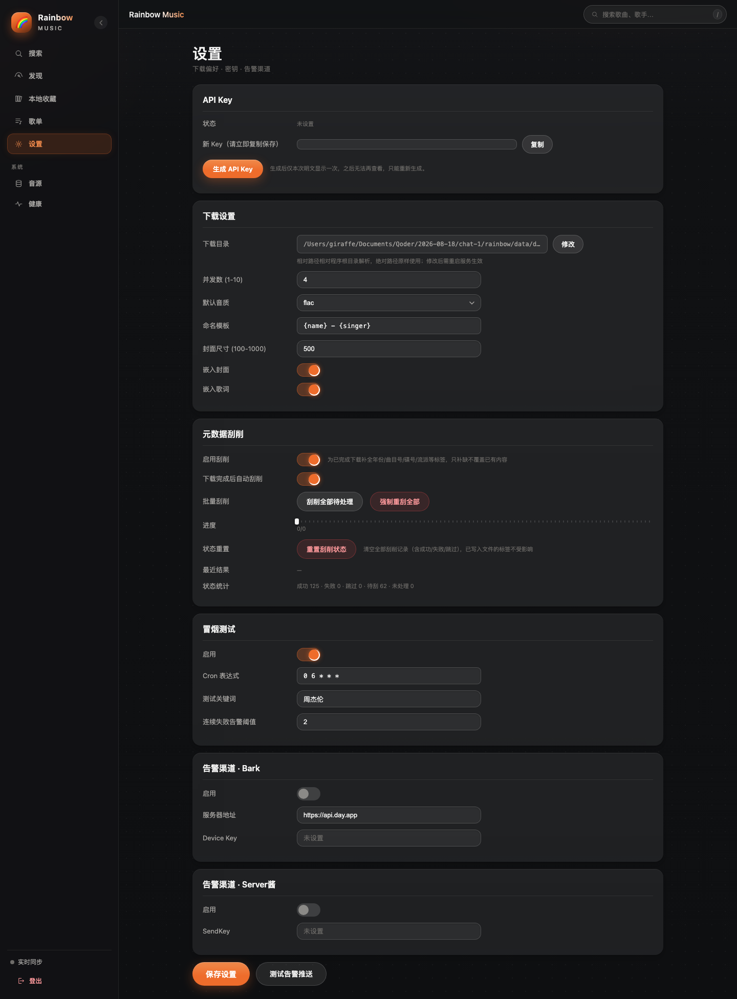

*图注：设置 —— 下载（含下载目录行：等宽绝对路径展示 + 「修改」按钮）/ 元数据刮削 / 冒烟测试 / 告警 / API Key 五组配置项（元数据刮削卡片含进度条与状态统计）。*

---

## 健康看板

健康页展示**冒烟测试**结果：系统按 cron（默认每天 06:00）对每个「音源 × 平台」组合跑一次真实的搜索 + 取 URL 链路，输出 🟢/🟡/🔴 矩阵与最近 N 天趋势。

- 某格持续红：多为该音源在该平台失效，优先更新音源；
- 「立即冒烟测试」按钮可手动触发（异步，完成后 SSE 推送）；
- 连续失败达到告警阈值时推送 Bark / Server酱 通知。

   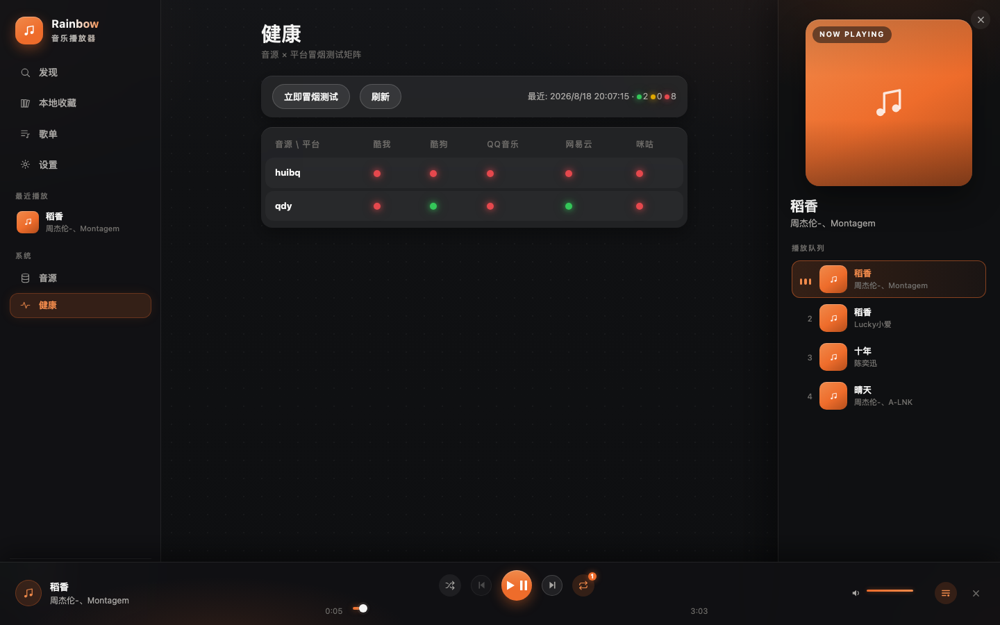

   *图注：健康看板 —— 平台×音源矩阵与最近趋势。*

---

## 升级与数据保留

- **升级**：应用中心上传新版 `.fpk` 覆盖安装（或 Docker 场景修改 compose 中 image tag 后 `docker compose up -d`）；
- **数据不丢**：音乐文件、音源脚本、SQLite（任务/歌单/用户数据）、`config.yaml` 全部在宿主机挂载卷，镜像本身不含数据；v0.2.1 升级的库结构变更为幂等加列，旧数据零丢失（歌单自动归属 admin，见 [FN ID 登录与多用户](#fn-id-登录与多用户)）；
- **镜像 tag 与版本严格绑定**（如 `v0.2.1-r1`，无 `latest`），回滚只需换回旧版 fpk/tag。

---

## 常见问题

**Q: 忘记登录密码？**
A: 编辑 `config.yaml` 的 `auth.webLogin.password` 为新密码后重启应用；session 存内存，重启后需重新登录。

**Q: 反向代理后实时进度（SSE）不动？**
A: 反代需关闭响应缓冲（Nginx `proxy_buffering off;`），详见 README 排错章节。

**Q: 镜像拉取失败？**
A: `docker logs rainbow` 查看报错；确认 tag 与版本一致且网络可达 ghcr.io（国内网络可能需要代理或镜像加速）。

**Q: 下载的音乐在哪？**
A: 设置页「下载目录」行显示的即当前实际生效的绝对路径（等价于 `config.yaml` 中 `download.dir` 解析后的位置）；悬停曲库任一歌曲行也会显示该文件完整路径。默认文件名为「歌曲名 - 歌手」，已嵌入封面与歌词标签。

**Q: 任务状态 `completed_with_warnings` 是失败吗？**
A: 不是。表示经跨平台换源兜底后成功下载，文件可正常使用。

**Q: FN ID 登录的用户和 admin 是什么关系？**
A: 完全独立的两个身份：admin 是端口直连的管理员（uid=`legacy`，向导密码登录）；FN ID 用户是经 fnOS 网关进入的每个 NAS 账号（各自 uid）。数据互不干扰，旧版数据归 admin。

**Q: NAS 音乐扫描不到文件？**
A: 依次确认：目录在安装向导里配置过且当时已存在（填的是绝对路径）、容器内已挂载（`docker exec rainbow ls /app/data/scan/`）、文件格式在支持列表（mp3/flac/m4a/ogg/opus/wav/aac）。详见 [FNOS-DEPLOY 排查指南](FNOS-DEPLOY.md#扫描根不可见排查)。

**Q: 所有平台都下载失败？**
A: 到健康看板看冒烟矩阵，通常是音源脚本失效 —— 重新导入有效音源即可。

**Q: 内存占用？**
A: 实测稳定 RSS ≈ 198MB，compose 默认 512MB 上限保护，对 NAS 无压力。
